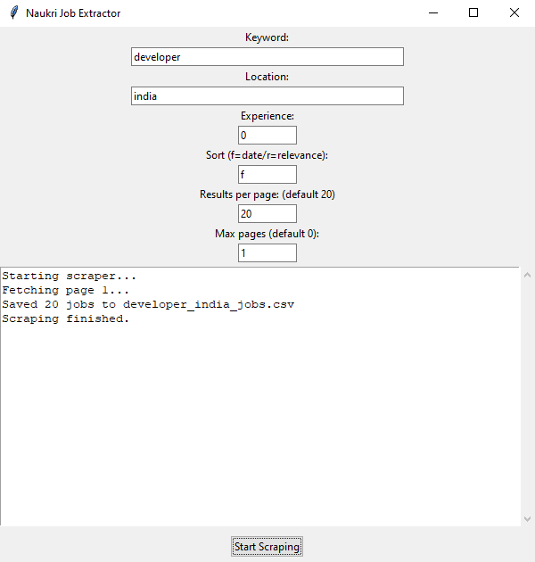

Naukri Job Scraper GUI

1. Features
- Search jobs by keyword, location, experience (0-5 years), sort order (by date or relevance), results per page, and max pages.
- Automatically scrape until last page if max pages set to 0.
- Converts HTML job descriptions to readable plain text with bullet points.
- Exports results to CSV files.
- Displays live scraping status in the GUI.

2. Enter your search parameters:
- Keyword (e.g., "AI Developer")
- Location (e.g., "Bangalore")
- Experience (e.g., 0)
- Sort** ('f' for date, 'r' for relevance)
- Results per page (e.g., 20)
- Max pages (0 to scrape all pages)
 
3. Click Start Scraping or configure auto-start on launch.
  
4. The app displays progress and saves job listings as CSV.

